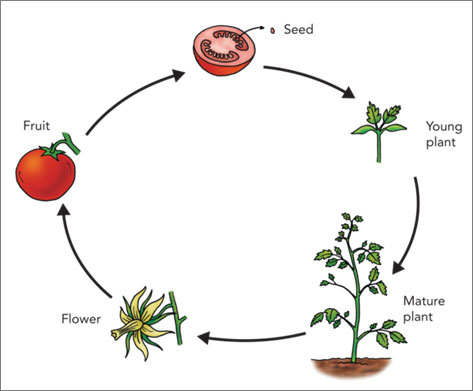

Requirements:
Look at the image below.
In 25 seconds, please speak into the microphone and describe in detail what the image is showing.
You will have 40 seconds to give your response.

Vocabulary:
Speaking

Tips: There is only a image, but not include title.

Filter: Test
Sort Type: Creation time(Ascending order)
Total: 32

为了帮你拿到 PTE 口语的高分，特别是流利度（Fluency）分数，我为你定制了针对 7 种具体题型的专属模板。
这些模板的设计原则是：结构固定（不动脑），连接词地道（像母语者），容错率高（填空即可）。

1. Bar Chart (柱状图) / Line Graph (折线图)
特点： 最常见的题型，重点在于对比（最高 vs 最低）和趋势（变化）。
Introduction:
"This chart gives a clear breakdown of [标题]. It compares several different items/years."
(描述最高值/主要趋势):
"What stands out immediately is that [最高那一项] has the highest figure, which is roughly [读数字,记得加 about/around]."
(最低值/相反趋势):
"On the flip side, if we look at [最低那一项], it shows the lowest number at just under [读数字]."
(中间值/补充):
"It is also interesting to note that the figures for [中间某一项] remained relatively stable/fluctuated over the period."
总结:
"So overall, we can see a significant difference between the highest and lowest categories."
   
2. Pie Chart (饼图)
特点： 重点在于占比（Proportion），一定要用到 "Slice" (切片) 或 "Portion" (部分) 这种词。
Introduction:
"The pie chart presented here effectively illustrates the percentage distribution of [标题]."
(最大块):
"It is crystal clear that the largest portion is occupied by [最大那一块的名字], which accounts for nearly [读百分比]%."
(最小块/对比):
"In contrast, the smallest slice represents [最小那一块的名字], with a figure of only [读百分比]%."
(颜色/其他):
"Moreover, the [颜色, e.g., blue] slice is also quite significant in this chart."
Conclusion:
"So, overall, [最大那一块] is clearly the dominant category in this group."

3. Table (表格)
特点： 数据最密集，最容易卡顿。秘诀是：只挑两行读，忽略其他的。
Introduction:
"This statistical table provides detailed information regarding [标题] over a specific period."
(挑一个最大的读):
"Scanning through the numbers, the maximum value is definitely found in [行/列的名字], which is around [数字]."
(挑一个最小的读):
"However, the minimum figure belongs to [行/列的名字], which is considerably lower at [数字]."
(凑时间):
"Also, the data varies significantly across the different columns and rows."
Conclusion:
"In conclusion, the table reveals some interesting trends regarding [标题关键词]."

4. Step Graph / Process / Flowchart (流程图)
特点： 有箭头，有顺序。一定要用顺序连接词。
Introduction:
"This diagram clearly outlines the step-by-step process of [标题/如何做某事]."
(起步):
"To kick things off, the first stage involves [第一步的内容]. Following this, it leads to [第二步的内容]."
(中间):
"Moving on to the next phase, we can see [中间某一步的内容], which is a crucial part of the system."
(最后):
"Eventually, after a series of steps, the process reaches the final stage where [最后一步的内容]."
Conclusion:
"Overall, this looks like a complex but systematic cycle/process."

5. Map Graph (地图)
特点： 没有数字，只有地点。重点用方位词 (North, South, Left, Right, Center)。
Introduction:
"This map provides a visual representation of the geographical layout of [标题/地名]."
(一边):
"If we look at the northern/western part, we can clearly see [读地名 1] and [读地名 2]."
(另一边/中心):
"Shifting our focus to the southern area / center, there is also [读地名 3] located next to [读地名 4]."
(凑内容):
"Moreover, different areas are marked with different colors/structures."
Conclusion:
"Overall, this map gives crucial information about the location and its surroundings."

6. Pictures (照片/实景)
特点： 可能是一张风景照、房间照或人物照。描述你看到的画面。
Introduction:
"This is an interesting picture that depicts a scene of [标题/大概内容，如: a busy city / a classroom]."
(前景/主要物体):
"In the foreground, the most prominent feature is [你看到的最大的物体/人], which takes up most of the space."
(背景/环境):
"In the background, we can observe [背景里的东西，如: sky, buildings, trees]. The weather/atmosphere looks quite [形容词，如: sunny, busy, modern]."
(细节):
"On the left/right side, there are also some [其他小物体] visible."
Conclusion:
"Overall, this image captures a very specific moment in [标题关键词]."

7. Diagrams (结构图/示意图/生命周期)
特点： 比如“火山结构”、“牙齿构造”、“青蛙生命周期”。重点在于读标签 (Labels)。
Introduction:
"This diagram illustrates the structure/lifecycle of [标题]."
(主要部分):
"According to the labels, the main part consists of [标签 1] and [标签 2]."
(其他部分):
"Connected to that, we can also see [标签 3] which is located at the top/bottom."
(颜色/功能):
"Also, the different parts are highlighted in various colors such as [说出图里的颜色]."
Conclusion:
"In conclusion, this diagram gives a comprehensive view of how [标题] works."

💡 给你的特别提示 (Native Tips)：
关于数字： 永远不要读精确数字！
看到 34,567 -> 读 "over thirty-four thousand"
看到 19.8% -> 读 "roughly twenty percent"
理由：这样更自然，而且不容易嘴瓢。
关于卡壳：
如果你说到一半忘了词，马上接一句废话："...and the data is quite significant." 或者 "which is very interesting." 然后赶紧跳到下一句模板。
关于语速：
PTE 机器不喜欢忽快忽慢。保持匀速，哪怕慢一点也没关系，关键是一直有声音。

Total template:
1. The following graph shows the information about (title);
2. It is shown that the items include (different items);
3. According to this graph, it can be seen that ( );
4. What is more, we can see that ( );
5. In conclusion, we can known the trend of (different items);

Branch template:

(Table, Bar, Pie): the largest/smallest number is ( ), which is ( ).
(Line): the number of ( ) increased/decreased slowly (dramatically/with a lot of fluctuation) from ( ) to ( ), reaching the (maximum/minimum) in ( ).
(Follow chart): the first/second/next step is ( ), (which is ).
(Map, Image): to the (left/right/top/bottom/central/outside) part of the picture, there is ( ), which is ( ).

    Step graph - 5
    Pie chart - 3
    Line graph - 4
    Bar chart - 4
    Table - 1
    Map graph - 6
    Image - 9

1.Ship lock operation. 船闸运作 (Step graph)

This graph provides information about ship lock operation. According to a picture, in the first stage, we can see a boat going downstream and upstream gate opens. After that, we can see the ship enters the lock, upstream gate closes and water level evens. In the final step, downstream gates are opened and the ship exits the gate. In conclusion, the graph gives information about the principle of ship lock operation.

2.Tomato processing cycle. 番茄加工周期 (Step graph)

The flowchart shows the processing of tomatoes in four steps.
First, tomatoes are collected from the plants and loaded into a truck.
Second, tomatoes are sent to the assembly line, where rotten ones are removed.
Next, good-quality tomatoes are selected and packaged.
Finally, they are sent to the market and are ready for sale.

3.Bottle recycling. 瓶子回收 (Step graph)

This image shows the recycling process of plastic bottles.
First, people drink the water and finish using the bottles.
Second, they squeeze the empty bottles and send them for recycling.
Third, the bottles go to a recycling factory.
Finally, new bottles are made from the old ones.
So this completes the loop.

4.Step to make instant coffee. 速溶咖啡制作步骤 (Step graph)

The diagram provides the information about steps to make instant coffee. The first step is to pour hot water in a cup. The second step is to open the coffee bag. The third step is to put instant coffee to a cup with hot water. The fourth step is to add the sugar and creamer to the cups. In the next step, stir with the spoon to dissolve the coffee. Finally, we can enjoy instant coffee. Overall, making instant coffee is quite simple.

5.Life cycle of tomatoes. 番茄的生命周期 (Step graph)

The flow chart is about the life cycle of a tomato plant. On the top of the picture, we can see there is a seed coming from a halved tomato. At the next stage, the seed turns to be a young plant, which is in green color. After that, the young plant grows into a mature plant with many leaves. At the next stage, we can see there is a flower. Finally, the flower turns into a round red fruit. In conclusion, the picture gives information about different stages of the tomato.

6.Air Composition. 空气成分 (Pie chart)

This pie chart gives information about the approximate composition of the air. As we can see from the graph, the largest proportion comes from nitrogen, which is 79. It is followed by oxygen, which is 20. While the smallest proportion can be found in other gases, which is only 1. Apart from that, it should be noted that other gases include carbon dioxide and small properties of other gases include argon and water vapour. In conclusion, the air in the atmosphere is mainly composed of nitrogen and oxygen.

7.Study foreign languages. 外语学习 (Pie chart)

This is a pie chart, this picture displays why students choose to study foreign languages, and it shows that forty-three percent of students choose to study foreign languages because of personal interest enjoyment, twenty-four percent because of degree requirements, and thirteen percent because they want to use it in their future careers. Nine percent of the students chose it because they want to travel and study abroad, six percent for family background, three percent for application for advanced degrees, and one percent for societal responsibility and one percent for other needs.

8.Households in Millions Who Own Pets. 养宠物的百万家庭数 (Pie chart)

The pie chart shows the percentage of households in millions who own pets.
On the bottom of the picture, there are all kinds of pets, such as bird and small animal.
Obviously, the largest figure belongs to dog, which is 69 million, accounting for 45 percent.
It is also clear that cat is the second most owned pet.
In contrast, saltwater fish owners take the smallest portion, which is only 2 percent.

9.Annual working hours. 年工作时长 (Line graph)

This line graph displays annual working hours in Germany between 1970 and 2017. According to the data, in Germany, the largest number comes from 1970, at 1973 working hours per year. It is followed by 1975, at 1812 hours per year. However, the smallest figure goes to 2017, which is about 1350 hours per year. It can also be noticed that in Germany, the annual working hours decreased over the time period. In conclusion, the annual working hours will continue to decrease in the future.

10.Mobile phone ownership. 手机拥有率 (Line graph)

The line chart shows the mobile phone ownership of American adults, from 2004 to 2018. According to the data, in terms of American adults who own cell phone has gradually increased from about 65 percent in 2004 to about 90 percent in 2019. In terms of U. S. adults who own a smartphone has grown from about 35 percent in 2011 to about 75 percent in 2019. In summary this graph shows the important information about the mobile phones ownership of American adults.

11.UK unemployment rate. 英国失业率 (Line graph)

This graph shows the relationship between homeownership rates and unemployment rates from 1986 to around 2011. The dashed line represents the homeownership rate, which generally declines from the late 1980s, experiencing fluctuations. The solid line indicates the unemployment rate, which increases significantly around 2008, aligning with the global financial crisis, before stabilizing around 6%. This suggests a potential correlation between rising unemployment and decreased homeownership over this period.

12.Arrests number for using illegal drugs. 吸毒逮捕人数 (Line graph)

This line graph shows the number of arrests per year for using illegal drugs from 1991 to 2005. The blue line represents the changes over time. From 1991 to 1995, arrests increased steadily, rising from about 10 to 60. Between 1995 and 1997, the number stayed the same, and then dropped sharply in 1999 to around 35. After that, arrests rose again, peaking at 70 in 2000. However, there was a dramatic fall in 2001, with the number dropping below 20. In the following years, arrests fluctuated, ranging between 40 and 50. Overall, the graph shows a fluctuating trend in illegal drug arrests, with a major drop in 2001. The blue line helps clearly show the ups and downs over the years.

13.Age group. 年龄组 (Bar chart)

This bar chart presents information about the percentage of population in different age groups. According to the data, in terms of females, the largest proportion can be found in between the age of 25 and 34, which is 16. 5 percent, while the smallest proportion can be found in aged 85 or over, which is only 1. 1 percent. In terms of males, the largest proportion can also be found in aged 25 to 34, which is 16. 2 percent. The smallest lowest proportion can be found in over the age of 85, which is only 0. 7 percent. In conclusion, this graph is about age distribution.

14.Chocolate consumers. 巧克力消费者 (Bar chart)

This bar chart presents information about the world's biggest chocolate consumers. According to the data, Switzerland consumes the most chocolate, with 19. 8 pounds per capita each year. After that we can see, Germany consumes the second-highest amount of chocolate in the world, with 17. 4 lbs each year. However, France is the ninth-largest consumer of chocolate, with 9. 3 lbs each year. It is interesting to note that both Ireland and the United Kingdom have the same amount of chocolate consumption each year, ranked as the third-largest in the world. In conclusion, this graph provides important information about the world's biggest chocolate consumers.

15.Mean salary. 平均薪资 (Bar chart)

This image is a bar chart, and according to the image we can know that this image shows the mean salary of first-degree graduates by gender, the horizontal axis in the image represents the year, there are 2008, 2009, 2010, 2011 and 2012. The vertical axis represents the mean salary, there are 18, 000, 19, 000, 20, 000, 21, 000 and 22, 000. Red color in the picture represents women and blue color represents men. From 2008 to 2011, there is no change in the mean salary of women, and in 2012 it is higher than the previous years. The mean salary for men has always been much higher than the mean salary for women in the same year. Overall, both men's and women's mean salaries were higher in 2012 than in previous years.

16.Largest Population Increase. 最大人口增长 (Bar chart)

This graph gives information about top 10 US cities with the largest population increase.
The largest number belongs to New York city, which is around 67000.
The next largest is Houston, which is around 34000.
The smallest number belongs to Forth Worth, which is around 16000.
Compared to Austin, Los Angeles is larger, which is around 25000.
In summary, this graph is interesting.

17.Change of Primary Funding Sources. 主要资金来源变化 (Table)

The table compares the primary funding sources for international students in the U. S. between 2003 04 and 2013 14. Overall, the total number of students increased by 55, from about 572, 000 to over 886, 000.
Personal and family support remained the main funding source, although its proportion slightly dropped from 67 to 65. Funding from U. S. colleges rose by 28, but its percentage decreased from 23 to 19.
The most significant increases came from foreign governments and current employers, growing by 383 and 390 respectively, rising from only 2 each to 7 and 6.
In contrast, funding from other sources declined by 14.
In summary, while most students still rely on personal funding, external support, especially from foreign governments and employers, has grown rapidly.

18.Population density. 人口密度 (Map graph)

This picture is about population density in the world. The largest population density is marked as black, 700 people per square kilometers, which can be found in North India and northeast of China. The medium population density is marked as red, 350 people per square kilometers, which is scattered across all continents. On the contrary, the smallest density is marked as orange, which is largely found in North and South Poles, Australia and Russia. In conclusion, Oceania has the lowest population density among all continents.

19.European countries. 欧洲国家 (Map graph)

This map shows information about the location of European countries. It can be seen from the graph that Germany, Switzerland, Austria and Hungary can be found in central Europe, while a number of countries in northern Europe that include Denmark, Norway, Sweden, and Finland. Apart from that we can see, Italy, Spain and Portugal are located in the southern part of Europe, while several countries in southeast Europe that include Romania, Bulgaria, and Greece. To sum up, this graph provides information about regions of Europe.

20.Nuclear power generation. 核能发电 (Map graph)

The map is about nuclear power generation in several European countries.
Note that Russian nuclear power plants are not on this map.
The highest nuclear share of total electricity generation is around 70 percent, which belongs to France.
In contrast, Ukraine has the lowest figure, which is around 31 percent.
This map is sourced from the IAEA in 2020.

21.Ladybird. 瓢虫 (Map graph)

This map depicts the distribution of the Harlequin Ladybird in England. The yellow colored region represents England. Black dots show the locations where the ladybird was found in 2005, while red dots indicate the locations in 2004. The map is sourced from UNI CAM APU CEH, providing a visual representation of the spread of the Harlequin Ladybird over these two years.

22.Map of Warm & Cold Currents. 暖流寒流地图 (Map graph)

The image illustrates the global ocean circulation system, showing the movement of warm shallow currents and cold and salty deep currents across the world's oceans. The warm shallow current, caused by solar heating of ocean waters, flows from the Pacific Ocean through the Indian and Atlantic Oceans. It releases heat into the atmosphere, as shown by the"Sea-to-Air Heat Transfer" label. The current then sinks in the North Atlantic, becoming a cold and salty deep current that circulates back to the Pacific. This continuous loop helps regulate Earth's climate and distribute heat around the globe.

23.Rainforests. 热带雨林 (Map graph)

This picture gives information about the distribution of rainforests in South America. According to the information, we can see the tropical rainforest in green, which can be found in the north and east part of south America, including Colombia, Ecuador, Bolivia and Brazil. However, we can see the temperate rainforest in dark green, which can only be found in the south eastern coastline of south America, covering part of Chile. This picture also talks about other areas like Pacific Ocean, Atlantic Ocean, Argentina and Falkland Islands. In conclusion, tropical rainforests are far bigger than temperate rainforests.

24.Ice thickness guidelines. 冰层厚度指南 (Image)

This graph presents information about minimum ice thickness guidelines for new clear ice only. According to the Department of Natural Resources, for ice fishing or other activities on foot, a minimum of 4 inches is needed. For snowmobile, 5 7 inches is needed, while for normal vehicles, 8 12 inches is recommended. Lastly, for driving a medium truck, 12 15 inches of solid ice is required. Overall, ice is never 100 safe.

25.Renewable energy. 可再生能源 (Image)

This graph shows information about London's expected energy target in 2030. As we can see from the picture, the largest proportion comes from heating and cooling, which is 51, and the renewable energy is 10. The second largest proportion is transport, which is 32. While the smallest proportion can be found in power, which is 17. Apart from that we can see the renewable energy is 26, and it shows an increasing trend. In conclusion, this graph gives informative information about expected energy target in London in 2030.

26.Main hall. 主厅 (Image)

This graph gives information about a floor plan of an office. As we can see from the picture, on the left-hand side, there is an office with a small kitchen. While on the right-hand side, we can see there are male toilet, female toilet and toilet for people who are handicapped. Besides, when we look at the top of the picture, there is a main hall. To sum up, this graph shows a simple office floor plan layout.

27.Weekly household spending. 家庭周支出 (Image)

This graph shows information about weekly household spending from 2015 to 2016 in Ireland. As we can see from the graph, transport is the highest household spending in Ireland, with 124 euro per week. Food is the second largest weekly household expenditure category, with 123 euro. Apart from that we can see, holiday is the fourth largest household spending item after medical, which is around 30 dollars per week. In conclusion, households in Ireland spend the most money on transport and food.

28.Fog. 雾 (Image)

The picture shows information about soot emissions in one of the cities in Asia. According to the picture, we can see the city suffers from high levels of smog that reduces visibility. At the bottom of the picture, we can see three women riding bicycles on the street. In the background, we can see pedestrians crossing the road. At the top of the picture, we can see a gray sky. To sum up, the government should think of ways to reduce soot emissions.

29.Students at the lab. 实验室学生 (Image)

This picture shows students taking a chemistry experiment class in a laboratory.
There are a total of four students in this scene, one boy and three girls, all wearing protective glasses and white clothes. They all look happy and curious.
In the lower left corner of the picture, we can see some smoke coming out.

30.Best food. 最佳食物 (Image)

The picture shows information about how to choose best food for brain health.
Firstly, on the left of the picture, we can see unhealthy foods represented in red color such as potato chips, fried chicken, donuts, ice cream and wine.
Obviously, gaining too much junk food can bring negative impacts to our brain.
On the right of the picture, on the contrary, there are healthy foods represented in green which can boost our brainpower.
To be specific, appropriate intake of fruits and vegetables such as carrots, bananas and broccoli can strengthen your fitness and moreover make your brain works better.
In conclusion, if we can change our bad habits of taking too much junk food and try to eat more organic fruits and vegetables, we will ultimately get stronger and keep our brain active.

31.Fruit market. 水果市场 (Image)

The picture shows information about a food market. According to the picture, the marketplace is an indoor market and is a very busy place. The market is crowded with green stalls selling a wide range of fresh food including fruits, vegetables and other goods. Except for stalls, there are lots of stores in the market as well. Also, we can see that some shoppers are bargaining with stallholders, while others are just casually browsing the stalls. In conclusion, this market is a great place for people to buy fresh food.

32.Water cycle. 水循环 (Image)

This graph shows information about the water cycle. According to the graph, the process starts from evaporation, and we can see the water is evaporated from the ocean due to solar radiation. The second stage is cloud transportation. The next step is precipitation. It can be seen that rain falls to the ground in this process. The last step is a surface run-off, and then the water will rise again into the atmosphere. In conclusion, this process will start all over again.

-------------------------------------------常用词汇----------------------------------------------------
在PTE考试的 Describe Image (DI) 题型中，词汇的准确性和流利度非常重要。为了帮你更好地准备，我将这些词汇分门别类整理如下，涵盖了图表结构、计量单位、趋势变化、比较极值以及连接词等核心模块。

一、 图表基础结构 (Chart Structure)
这些词用来描述图表的“骨架”，通常用在第一句或描述具体位置时。

英文单词/词组	                        中文解释	        备注
X-axis / Horizontal axis	        X轴 / 横轴	        底部横向的线
Y-axis / Vertical axis	            Y轴 / 纵轴	        左侧纵向的线
Legend	                            图例	            告诉你看不同颜色代表什么的说明
Layout	                            布局	            地图或平面图常用
Categories	                        类别	            比如：食品、交通、住宿等分类
Variables	                        变量	            变化的数值
Source	                            来源	            图片下方的小字 (The source is...)
Shaded area	                        阴影区域	        常见于地图或部分柱状图
Dotted line / Solid line	        虚线 / 实线	        线图常用
Bar / Column	                    柱 / 栏	            柱状图
Slice / Segment	                    切片 / 部分	        饼图专用

二、 常见计量单位 (Units & Measurements)
这是你提到的重点，必须读得准，不要卡顿。

英文单词/词组	                        中文解释	            读音/用法提示
Degrees Celsius	                    摄氏度 (°C)	            读作 "degrees Celsius"
Fahrenheit	                        华氏度 (°F)	            读作 "Fahrenheit"
Percentage / Percent	            百分比 (%)	            符号读 "percent"，名词用 "percentage"
Billion / Million	                十亿 / 百万	            注意：前面有数字时不要加s (e.g., 5 million)
Tonnes / Kilograms	                公吨 / 千克	            重量单位
Square kilometers	                平方公里 (km²)	        读作 "square kilometers"
Cubic meters	                    立方米 (m³)	            读作 "cubic meters"
Per capita	                        人均	                e.g., income per capita (人均收入)
Currency	                        货币	                总称
Dollars / Pounds / Euros	        美元 / 英镑 / 欧元	    $ / £ / €
Barrels	                            桶	                    石油常用单位

三、 趋势与变化 (Trends & Changes)
这是线图（Line Chart）和混合图的灵魂，用来描述数据怎么变。

1. 上升 (Up)
Increase: 增加
Rise / Rose: 上升
Climb / Ascend: 攀升
Grow: 增长
Peak at: 在...达到顶峰 (最高点)

2. 下降 (Down)
Decrease: 减少
Decline: 下降
Fall / Fell: 落下
Drop: 跌落
Plunge / Plummet: 暴跌 (急剧下降)
Hit a low of: 触及最低点...

3. 平稳与波动 (Stable & Variable)
Remain stable / Constant: 保持稳定
Level off: 趋于平稳
Fluctuate: 波动 (上上下下)
Vary: 变化 (不同类别之间不同)

4. 程度副词 (Adverbs - 增加分数关键)
Significantly / Drastically: 剧烈地、大幅度地
Gradually / Steadily: 逐渐地、稳步地
Slightly: 轻微地

四、 极值与比较 (Extremes & Comparisons)
用于柱状图（Bar Chart）和饼图（Pie Chart）抓重点。
英文单词/词组	中文解释	例句用法
The highest figure	最高的数据	"The highest figure can be found in..."
The lowest value	最低的数值	
Maximum / Minimum	最大值 / 最小值	
The majority of	绝大多数	饼图常用
The minority of	极少数	
Account for / Comprise	占据 / 构成	"Water accounts for 50%..."
In contrast	相反 / 相比之下	连接两个相反的数据
Is followed by	紧随其后的是...	描述第二名时用
Gap / Difference	差距	"The gap between A and B..."
Overlap	重叠	韦恩图或特定图表

五、 地图与流程图专用 (Maps & Flowcharts)
这两类图比较特殊，需要方位词和顺序词。
1. 地图 (Maps)
Northern / Southern Hemisphere: 北半球 / 南半球
Equator: 赤道
Latitude / Longitude: 纬度 / 经度
Located / Situated in: 位于...
Coastal area / Inland area: 沿海地区 / 内陆地区
Top left / Bottom right: 左上角 / 右下角
2. 流程图 (Flowcharts)
First step / Initial stage: 第一步 / 初始阶段
Subsequent step: 接下来的步骤
Process / Cycle: 过程 / 循环
Convert into / Transform into: 转化为...
Finally / Eventually: 最后

六、 必备套话模版词 (Templates & Connectors)
为了保证流利度，这些词可以帮你填补思考的空白。
开场:
"The graph gives information about..." (这张图提供了关于...的信息)
"As we can see from the image..." (正如我们从图中看到的)
连接:
"Furthermore / Moreover" (此外)
"On the other hand" (另一方面)
"Moving to the next point" (转到下一点)
结尾:
"In conclusion" (总而言之)
"Overall, the trend is clear." (总体来看，趋势很明显)
💡 给你的备考小贴士：
不要纠结语法：DI主要看流利度（Fluency），时态错了或者单复数错了不要停下来改，继续说！
看到什么说什么：如果你突然忘了“X轴”怎么说，直接读X轴上的标题（比如 Time, Year）即可。
数字读法：
1990: Nineteen ninety
2005: Two thousand and five
25%: Twenty-five percent
$100: One hundred dollars (记得加s)
希望这份清单对你有帮助！如果需要具体的模版，也可以告诉我。

-----------------------------------------模板-----------------------------------------------------
PTE考试中，DI（Describe Image）评分的核心逻辑是：流利度 (Fluency) > 发音 (Pronunciation) > 内容 (Content)。
也就是说，说的顺畅、不停顿、不卡壳，比你分析得深奥重要得多。
为您总结了3个最实用、最易背的“万能模板”，分别针对数据图（柱状、饼状、线图）和非数据图（地图、照片、流程图）。

模板一：数据万能版 (最推荐，适用于90%的图表)
【适用】：柱状图 (Bar)、饼图 (Pie)、线图 (Line)、表格 (Table)。
【核心逻辑】：找最大值、最小值、读标题。
第一句 (Introduction):
The following graph gives information about [读标题].
(这张图提供了关于...的信息)
第二句 (Highest):
According to the graph, the highest figure is [最大值的名称], which is [具体数字].
(根据图表，最高的数据是...，数值是...)
第三句 (Lowest):
On the other hand, the lowest figure is [最小值的名称], which is [具体数字].
(另一方面，最低的数据是...，数值是...)
结尾 (Conclusion Trend):
In conclusion, it is clear that [名称A] is higher than [名称B].
*(很明显，A比B要高) —— 如果找不到具体数据，这句话可以用来凑时间
💡 使用技巧：
只要把括号里的词替换掉，其他部分像念经一样背熟，保持语速匀速即可。

模板二：无脑列举版 ( "I can see" 大法)
【适用】：地图 (Map)、照片 (Picture)、复杂的混合图、或者你实在看不懂图的时候。
【核心逻辑】：看到什么读什么，不要纠结语法。
第一句:
The image describes [读标题/或者图片主题].
主体部分 (排比句轰炸):
I can see [图中单词/物体 A].
I can see [图中单词/物体 B].
I can see [图中单词/物体 C].
I can see [颜色/形状/年份]. (例如: I can see blue and red; I can see 2024)
结尾:
In conclusion, the image is about [再读一遍标题].

💡 使用技巧：
PTE机器很吃这一套，因为它检测到了简单的语法结构和关键词。比如地图题，你就一直说 "I can see North America. I can see water. I can see mountains." 只要流利，分数会很高。
模板三：极简流利版 (针对基础较弱或容易卡顿的同学)
【适用】：所有图。
【核心逻辑】：减少思考，用最简单的句型串联关键词。
开头:
This graph shows [标题].
中间 (把图里的单词读出来):
There is [单词 A] and [单词 B].
There is also [单词 C] and [单词 D].
Also, the figures are increasing / decreasing. (如果是线图就加这句，不是就算了)
结尾:
Overall, the graph provides accurate data.

⚠️ 考试实战 3大原则 (救命稻草)
如果你卡住了：
千万不要说 "Uh..." 或者停下来。马上说一句万能废话："Also, I can see different numbers and colors." (我也能看到不同的数字和颜色)，然后赶紧找下一个词读。
如果你看不清数字：
不要纠结是 10.5 还是 10.6，直接读 10。大概准确即可，PTE不考你的视力。
时间控制：
DI 只有 40秒 录音时间。
最佳策略：说 25秒 - 35秒 左右说完点Next。没必要撑满40秒，说多错多。
一旦说完 "In conclusion..." 马上点 Next，不要等待。
建议练习方法：
挑一张图，先用中文大概过一遍（标题、最大、最小），然后套进【模板一】里试着说，练到不用过脑子就能蹦出 "The following graph gives information about..." 为止。
