Requirements:
You will hear a lecture.
After listening to the lecture, in 10 seconds, please speak into the microphone and retell what you have just heard from the lecture in your own words.
You will have 40 seconds to give your response.

Vocabulary:
Listening Speaking

Filter: Test Hot
Sort Type: Creation time(Ascending order)
Total: 67

\*\*Comments: There is only a lecture, but it does not include title.

Total:
The lecture is about ( ).
The speaker argues the statement with supporting details, including ( ).
According to the lecture, it is known that ( ).
It is also known that ( ).
It is clear that ( ).
It is also clear that ( ).
In conclusion, this lecture is about ( ).

Tips:
尽量写单词(10-15 个) ———— 实词为主
注意重复出现的实词
注意信号 - But, Although, However, So, Because ...
注意语气变化 - 放慢，重读
注意数据 - 具体数值，年份，百分比...
注意开头和结尾出现的词

1.Infinite Monkey Theory. 无限猴子定理

The infinite monkey theorem states that a monkey hitting keys at random on a typewriter keyboard for an infinite amount of time will almost surely type a given text, such as the complete works of William Shakespeare. In this context,"almost surely" is a mathematical term with a precise meaning, and the"monkey" isn't an actual monkey, but a metaphor for an abstract device that produces a random sequence of letters ad infinitum. The theorem illustrates the perils of reasoning about infinity by imagining a vast but finite number, and vice versa. The probability of a monkey exactly typing a complete work such as Shakespeare's Hamlet is so tiny that the chance of it occurring during a period of time of the order of the age of the universe is minuscule, but not zero.
But technologies can help monkeys to write. If the monkeys are given a pen and some papers to spell the word monkey, they can only scratch on the paper. By contrast, if they are given a typewriter, it will take them over 10 years to produce the right spelling. However, if they can use computer programing, they can finish the task within a day.

2.Galaxy Darkness. 星系暗物质

Our friends at the Highlands Museum and Discovery Center in Ashland, Kentucky, asked a very good question. Why is it dark in space?
That question is not as simple as it may sound. You might think that space appears dark at night because that is when our side of Earth faces away from the sun as our planet rotates on its axis every 24 hours. But what about all those other far away suns that appear as stars in the night sky? Our own Milky Way galaxy contains over 200 billion stars, and the entire universe contains over 100 billion galaxies. You might suppose that many stars would light the night like daytime.
Until the 20th century, astronomers didn't think it was even possible to count all the stars in the universe. They thought the universe went on forever. In other words, they thought the universe was infinite.
Besides being very hard to imagine, the trouble with an infinite universe is that no matter where you look in the night sky, you should see a star. Stars should overlap each other in the sky like tree trunks in the middle of a very thick forest. But, if this were the case, the sky would be blazing with light. The problem greatly troubled astronomers and became known as Olbers Paradox. A paradox is a statement that seems to disagree with itself.
So, to try and explain the paradox, some 19th century scientists thought that dust clouds between the stars must be absorbing a lot of the starlight so it wouldn't shine through to us. But later scientists realized that the dust itself would absorb so much energy from the starlight that eventually it would glow as hot and bright as the stars themselves.
Astronomers now realize that the universe is not infinite. A finite universe that is, a universe of limited size even one with trillions and trillions of stars, just wouldn't have enough stars to light up all of space.
Although the idea of a finite universe explains why Earths sky is dark at night, other causes work to make it even darker.

3.Welsh Speaker. 威尔士语使用者

Welsh is a Celtic language spoken in Wales by about 740, 000 people, and in the Welsh colony in Patagonia, Argentina by several hundred people. There are also Welsh speakers in England, Scotland, Canada, the USA, Australia and New Zealand. At the beginning of the 20th century about half of the population of Wales spoke Welsh as an everyday language. Towards the end of the century, the proportion of Welsh speakers had fallen to about 21. According to the 2001 census 582, 368 people can speak Welsh, 659, 301 people can either speak, read or write Welsh, and 797, 717 people, 28 of the population, claimed to have some knowledge of the language. According to a survey carried out by S4C, the Welsh language TV channel, the number of Welsh speakers in Wales is around 750, 000, and about 1. 5 million people can understand Welsh. In addition, there are an estimated 133, 000 Welsh-speakers living in England, about 50, 000 of them in the Greater London area.

4.Bomb calorimeter. 弹式量热计（科学标准译法）

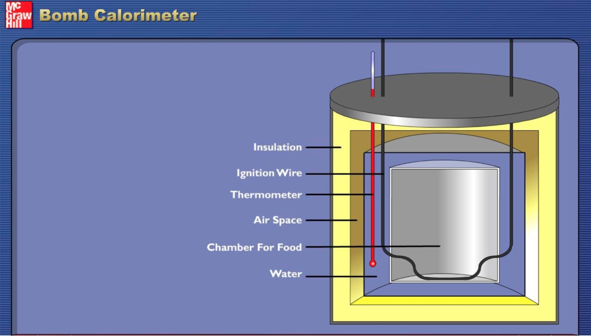

This is a bomb calorimeter; this is the actual piece of equipment that researchers used to calculate the energy content of either biodiesel or maybe even the potato chips that you had for lunch today. When they calculate the amount of energy. They're going to calculate it in heat unites which would either be joules or calories. I want you to look inside the bomb calorimeter inside here, you can see that there's a silver bucket water goes all in here and this is actually the bomb is the smaller silver cylinder what you do is put your fuel sample in there then these two electrodes are connected to the bomb. These provide the spark that will ignite your sample when your sample burns or combust that gives off energy. So how is the energy collected or how did a scientist figure out how much energy is being given off. Well, it's a closed system, there's a lid here that goes on top of this calorimeter and what's in here in the lid is a stirrer. The stir is going to stir the water. That's in this big pool here so that the heat given off from the sample is going to warm the water in a uniform way. This is the temperature probe, this goes down in the water also and measures the change in temperature because as the sample is burned, it will give off heat and the temperature the water will increase. So the lid goes on the sample is prepared. The last thing that you need to make a combustion reaction happen is oxygen and at some point during the process, some oxygen is added by a tank. That's connected to the calorimeter here. So we are going to burn a sample of the biodiesel that you've prepared and get some feedback on the energy content of it. You'll be able to use this to compare it to petroleum-based fuels like octane.

5.Australian Export Business. 澳大利亚出口业务

Thanks for this opportunity to speak about Australia's engagement with Asia from the perspective of trade and in particular to say a few words about what trade is doing in this, in this space.
And I'm particularly pleased to be addressing trade and investment, not just of course because these two things are inextricably linked, but also of course because Australia reports to Australia's first ever Minister for trade and investment.
Asia's importance to Australia's economy is growing by the day.
It is one of the most important factors to consider, when assessing the International conditions for national prosperity.
Asian demand for our exports has helped Australia manage the global financial crisis better than most other developed economies.
In fact, probably better than all other developed economies.
An investment from Asia has added to the productive capacity of the economy and to overall productivity.
In 2013, Seven of our top ten export markets were in Asia and represented 65 percent of our total exports.
Asian markets and Australia's geographic, geographic proximity are critical not just for our trade ties, and our capacity to access important global supply chains, but also to the level of foreign investment in Australia.
FDI has grown markedly in Australia over the past decade.
In fact it has more than doubled from about two hundred ninety two billion dollars to 630 billion dollars in 2013.

6.Variation in Frogs. 青蛙的变异

Frogs are a diverse and largely carnivorous group of short-bodied, tailless amphibians composing the order Anura. The oldest fossil proto frog appeared in the early Triassic of Madagascar, but molecular clock dating suggests their origins may extend further back to the Permian, 265 million years ago. Frogs are widely distributed, ranging from the tropics to subarctic regions, but the greatest concentration of species diversity is found in tropical rain forests. There are approximately 4, 800 recorded species, accounting for over 85 of extant amphibian species. They are also one of the five most diverse vertebrate orders.
Besides living in fresh water and on dry land, the adults of some species are adapted for living underground or in trees. Adult frogs generally have a carnivorous diet consisting of small invertebrates, but omnivorous species exist and a few feed on fruit. Frogs are extremely efficient at converting what they eat into body mass. They are an important food source for predators and part of the food web dynamics of many of the world's ecosystems. The skin is semipermeable, making them susceptible to dehydration, so they either live in moist places or have special adaptations to deal with dry habitats.
Frogs produce a wide range of vocalizations, particularly in they are breeding season, and exhibit many different kinds of complex behaviors to attract mates, to fend off predators and to generally survive. Frog populations have declined significantly since the 1950s. More than one-third of species are considered to be threatened with extinction and over one hundred and twenty are believed to have become extinct since the 1980s. The number of malformations among frogs is on the rise and an emerging fungal disease, chytridiomycosis, has spread around the world. Conservation biologists are working to understand the causes of these problems and to resolve them. Frogs are valued as food by humans and also have many cultural roles in literature, symbolism and religion.

7.Human's Creativity. 人类创造力

Here are three important factors in creativity: people, process and product. The most important one is the process.
First you have to create the right person through education with a creative mind. Second, you have to create the right process to have people engaged in innovation process. Third, you need to find the right problem to work on. Human beings can survive and prosper largely depending on the creativity they have. If you identify and assess the creativity of a finished product, it is taken as a proxy for the creativity of the person who produced such a product. Therefore, a creative product should be surprising, original, beautiful and useful. People should have factors necessary for genius, ability, and right mindset. You should improve to imitate and change insight look from new perspectives, innovatively create something with imagination to expand conceptual spaces.

8.Performance of boys and girls. 男孩女孩表现差异

You can see that the two charts, each give quite a different picture of the performance of boys and girls in the two key subjects of Math and English. It shows that in English, girls consistently outperform boys over a period of 6 years, achieving scores about 10 above their male peers. There is quite a different picture when we look at the Math results with no real difference between genders in the results. What is the explanation for these key differences? To answer this question, researchers look at biological and cognitive factors, and a range of social factors. The interaction between these different components in early childhood development are seen as maintained and reinforced in the school context. And this leads to distinct gender patterns of behavior and skills with direct consequences for school performance and achievement. The ultimate uses of this evidence( are) to show that biological factors, such as patterns of cognitive developments are closely linked to social factor, such as learned gender categories. This cognitive skills are learned both pre-school and subsequently at school, supported by the responses of teachers, creating a reinforcement of patterns.

9.Underwater Detectors. 水下探测器

---

10.Three Stages of Brain Development. 大脑发育三阶段

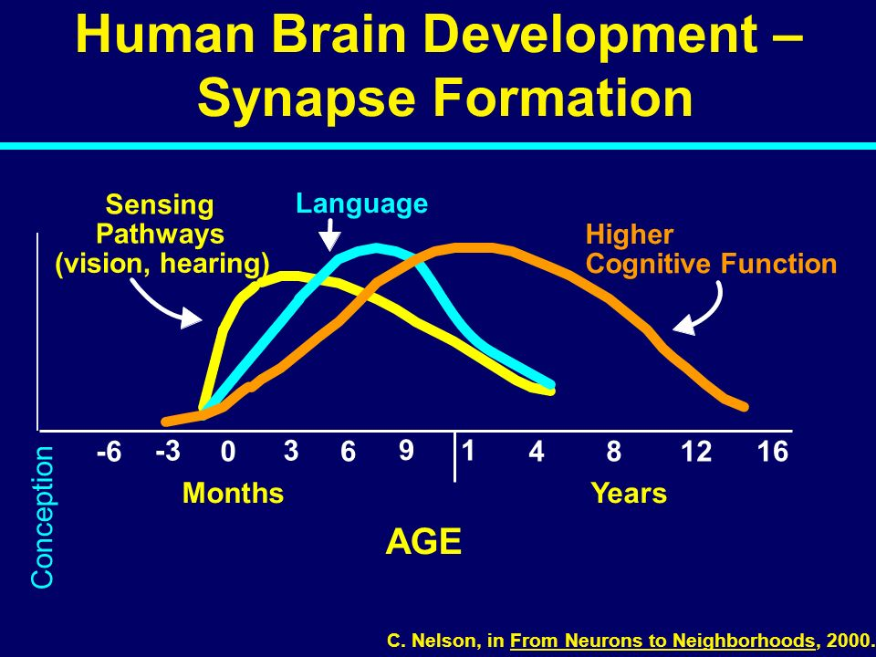

Stages of Brain development brain development during childhood, there are three stages, starting from the primitive brain, limbic brain, and finally to the neocortex. Although interrelated, the three had its own function. Primitive brain functions to manage the physical to survive, manage reflex, motor motion control, monitoring body functions, and process information coming from sensing. Limbic brain functioning as a liaison to process emotions and the brain thinks, and the primitive brain. While the thinking brain, which is the most objective part of the brain, receiving input from the primitive brain and the limbic brain.
However, he needed more time to process information from the primitive brain and the limbic brain. The brain thinks the merger is also a place of experience, memory, feeling, and thinking ability to give birth to ideas and actions. Nerve myelination of the brain takes place in sequence, starting from the primitive brain, the limbic brains, and brain thought. Neural pathways are more frequently used to make more myelin thicken. Increasingly thicker myelin, the faster the nerve impulses or signals travel alone nerves. Therefore, a growing child is encouraged to receive input from the environment in accordance with its development.

11.Marshmallow test. 棉花糖实验

They call it the marshmallow test. A four to six year old child sits alone in a room at a table facing a marshmallow on a plate. The child is told:" If you dont eat this treat for 15 minutes you can have both it and a second one. Kids on average wait for five or six minutes before eating the marshmallow. The longer a child can resist the treat has been correlated with higher general competency later in life.
Now a study shows that ability to resist temptation isn't strictly innate it also highly influenced by environment. Researchers gave five year old used crayons and one sticker to decorate a sheet of paper. One group was promised a new set of art supplies for the project but than never received it. But the other group did receive new crayons and better stickers.
Then both groups were given the marshmallow test. The children who had been lied to waited for a mean time of three minutes before eating the marshmallow. The group that got their promised materials resisted an average of 12 minutes.
Thus, the researchers note that experience factors into a child's ability to delay gratification. When previous promises have been hollow, why believe the next one?

12.Civil Society Groups. 公民社会团体

But in the face of this sense of dis-empowerment, there is no decline in involvement in organizations, which seek to share wealth and opportunities, which seek to protect one another's rights and work towards the common good. According to the UN, civil society groups have grown 40 fold since the turn of the last century. Sorry, since the turn of the year last century.
Internationally, the non-profit sector is worth one trillion dollars, there are 700, 000 not for profit organizations in Australia alone. The UN recognizes 37, 000 specifically civil society organizations across the globe working international relief, and gave accreditation for many of them.
This profound movement towards harnessing voices and resources from outside the realm of governments and officialdom reflects a growth in trust, the third sector NGO's. Putnam discovered in the field of local government in Italy. The best predictor of governmental success was the strength and density of a region's civic associations.

13.Climate change. 气候变化

Some adverse effects of climate changes to agricultural productions. Some lands are unsuitable for growing crops. There will be millions of people facing hunger in Africa in the near future. Climate change will result in less production and less food. It is difficult for developing countries to deal with climate change due to their financial status and other issues. There are many people living in hunger especially in Africa.
The climate change has devastating effects on world economy. The tropical areas on earth are dry and hot, and are originally not suitable for food production. The change of climate leads to extreme weather conditions such as floods and hurricanes, which exacerbates the food production.
As a result, it leads to a continuous decline in food supply annually around 10 to 17. And this trend is perceived to be continuing in the future by 2070. The regions suffering the most will be some African countries.

14.Narratives. 叙事

The comics I show you with lots of people chatting around in a room is a form of description. We use different kinds of methods to describe a situation. Sometimes we have to use visual description, particularly when we do not witness the scenario. I was born during the Second World War and my hometown is X, for example when I asked my mother about the war, I always ask her you have mentioned this or that when you talked to me when asked her about the shelter, I asked her what the shelter looks like and when did you go to the shelter. From her response I could get more visual evidence as I can to write my book.

15.Australian city. 澳大利亚城市

Australia's location is important for the world's export, and it's international trade is also very important. Since Australia has a broad territory, all towns are scattered around. There is a huge expense for transportation for trains and ferries. The government also pays large amount for its telecommunication to build up the connection among regions. The Australian people are mainly living in five cities, and they are Melbourne, Sydney, Perth and Brisbane and so on. The most special one is Perth, which is one of the most isolated cities in the world. However, this does not affect its state to be the largest city in Australia. Most large companies, like the two leading company, Telstra and Qantas, they are all based in Perth.

16.Human behavior. 人类行为

Determinant, human behavior is affected by internal and external factors. At the end of lecture, the speaker mentioned that psychologists are interested in explaining human behavior.
Determinant is influenced by two factors, the personal factors which are internal and the environmental factors which are external. The personal factors include people's belief on certain things and their individual thinking about it, while the environmental factors include temperature, air pressure and the others thinking about them. In conclusion, one's determinant are affected by both himself and the environment.

17.Overweight problem. 超重问题

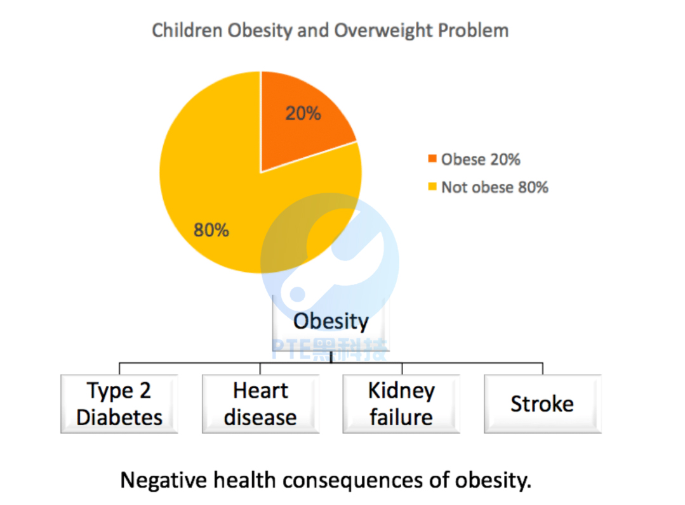

This lecture talks about the overweight problem.
According to the speaker, he has mentioned some points of view.
There are 20% of children today have the overweight problems, which bring the heart diseases are more and more common in children, the smallest is 5 years old.
This situation makes the heart attack and other health problems become earlier and earlier.
This issue needs to be solved because the overweight problems will be in more serious situations such as diabetes type 2 and blindness.

18.Black Hole. 黑洞

This simulation shows what you might see. If you are orbiting a black hole. The light and position of background stars around the hole are distorted by its gravity and they seem to spin around. On the right the constellation Orion appears to approach the event horizon the boundary from which nothing can escape. Orion stars look like they become separated and get spun around. Once the hole has passed by Orion reappears on the left and looks normal again. Users can also experiment with different scenarios. This is what you might see if you were travelling towards a black hole with rocket engines slowing your descent. Another simulation mimics free fall into a hole. In the middle the light of the entire universe appears to be concentrated in a bright ring.

19.Loggerhead Turtles. 红海龟

It is time for this young loggerhead Turtle to go to work.
We can tether turtles in these little cloth harnesses, put them in this tank， and they'll swim in place.
University of North Carolina Biologist Ken Lohmann studies sea turtles that are programmed from birth for an extraordinary journey.
The mother turtles bury the eggs on the beach and then return to the sea and the eggs hatch about 50-60 days later.
With support from the National Science Foundation, Lohmann is learning
how these reptiles use the Earth magnetic field to navigate a 5-10-year joumey around the Atlantic Ocean.
The turtle seems to inherit a set of responses that tell them what to do when they encounter specific magnetic field at particular locations.
This animal magnetism can be a life saver.
One filed off Portugal triggers the turtles to turn south. If they don't, they will likely die, swept into frigid North Atlantic waters.
In one lab test, turtles responded to magnetic fields similar to what they would encounter off coast of Florida.
The great majority of them turned southeast.
Now, this is an exciting finding because south easterly orientation in this part of the world, would presumably take turtles further into the Gulf Stream.
So turtles actually have, what might be considered, a crude global positioning system that is based on the Earth magnetic field.
And check out this experiment, these turtle moves may look odd.
The turtles will actually act out their swimming behaviour in air.
But this wave simulator recreates the first environmental cue hatchling turtles respond to.
And so swimming into waves is a highly reliable trick that turtles use to guide themselves offshore.
I guess you can call it, TPS, the turtle positioning system.
And while we humans spend hundreds of dollars for device like this that tells us where in the world we are, the turtles just know.
Understanding how that works will help us protect the species.
Now the only question is, how can we help them get out of their shell?

20.Engineers. 工程师

---

21.Randomness of flipping coin. 抛硬币随机性

Flipping a coin may not be the fairest way to settle disputes. About a decade ago, statistician Persi Diaconis started to wonder if the outcome of a coin flip really is just a matter of chance. He had Harvard University engineers build him a mechanical coin flipper. Diaconis, now at Stanford University, found that if a coin is launched exactly the same way, it lands exactly the same way.
The randomness in a coin toss, it appears, is introduced by sloppy humans. Each human-generated flip has a different height and speed, and is caught at a different angle, giving different outcomes.
But using high speed cameras and equations, Diaconis and colleagues have now found that even though humans are largely unpredictable coin flippers, there's still a bias built in, If a coin starts out heads, it ends up heads when caught more often than it does tails. NPR's David Kestenbaum reports.

22.British policy. 英国政策

1. The British press came into being in the 18th century.
2. Freedom of speech was encouraged since then.
3. People could take about anything in public places, such as in coffee house or on streets.
4. There they read newspapers and talked about politics and military matters.
5. It is a great sign of public freedom.

   23.Morton Prince. 莫顿·普林斯

Morton Prince was an American physician and psychologist, his book Dissociation of a Personality was the best-seller at that time. It tells a story of Miss Christine Beauchamp, who was suffering from MPD( Multiple Personality Disorder). Miss Beauchamp have several personalities, namely B1, B2 and B3. There was hidden memory in these 3 personalities. Miss Beauchamp was B2. B2 knows about B1, B3 knows both B1 B2, but B1 knows nothing about B2 or B3. The strongest personality account for most of the time and it will take over the others and become the main personality at the end. This case and theory give great help to crime investigation.

24.Gene and DNA. 基因与 DNA

In this lecture, the speaker talked about the gene and DNA.
At the beginning of the lecture, the speaker mentioned that genes decide the protein in the cells.
He further mentioned that there are more than 2M proteins in a cell.
At the end of the lecture, the speaker concluded that there is still not result for the functions of different cells.

25.Price of Housing. 房价

The impact on young Australians who are interested in buying a home of their own has been very significant. Australia's housing affordability now shapes the typical housing cycle or housing career as some people call it. Most Australians in the normal course of events are people who move through the housing cycle in a way that matches the stages of life that they're at. So, they move out of the family home in their late teens or early 20s as they gain their independence from their families, then they rent save for a home they can afford as either a group, or maybe a couple. And maybe they can upgrade it when they have a family in their middle age, they are more than likely to have paid off their mortgage. And that means they have housing security in their old age. That's no longer the typical housing cycle for Australians, young people generally live at home for much longer than they once did. They generally rent for longer and they're more likely to be saddled with a mortgage not just into their middle age but more often than not into their retirement as well. In fact, in 2006, 65, 000 retiree households were still paying off the mortgage. Affordable rent is also an elusive right around Australia. We have very low rental vacancies, we see high turnover as landlords want to maximize their profits in tight market, and we see less long-term or lifelong rental, as we see in other countries and other economies.

26.Mars. 火星

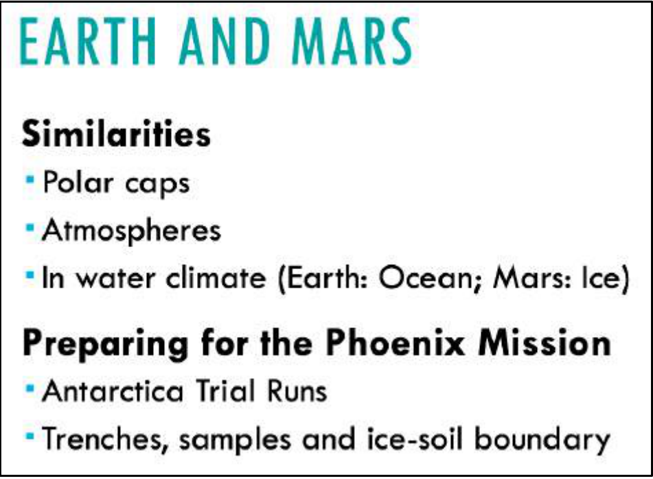

A PPT is given, and you can read it accordingly. This lecture compares the conditions on the earth and Mars, as well as the habitability of Mars. There are some similarities such as polar caps, atmospheres and water climate. But Mars and the earth also have lots of differences. Even the most inhabitable areas on the earth are way different from those on Mars. In preparing for the Phoenix Mission, scientists have done Antarctica trial runs. The lecture also describes different forms of water (hydrology) on the surface and underground of the earth and Mars.

27.Trade-offs triangle. 权衡三角

Video
Well, it is about whether you can achieve a win-win solution, whether you can achieve economic growth which brings wealth in order to cut a poverty without damaging by diversity. And the argument is that if you want to protect biodiversity, you have to focus on that as a goal, but if you do that, you are on the risk of hurting the poor, you are also on the risk of inconvenience in reducing economic growth. And we used in developed countries, industrialized countries, to see this argument, this axis argued about. We, let us say a government wishing to start drilling for oil in place x which is full of wildlife and wildlife conservation society is urging them not to on the grounds that it’s a wildness refuge. We used to that debate. I was saying in the developing world is third axis, and it’s quite a complex one.

---

Summary：
The speaker was discussing trade-offs between conservation, development and poverty. He said we need a win-win solution and achieve economic growth which brings wealth in order to cut a poverty without damaging by diversity. He highlighted that in order to protect biodiversity, people are on the risk of hurting the poor and reducing economic growth. Finally the speaker said that in the developing world, it is quite complex.

28.Three plans to stimulate the consumer. 刺激消费者三方案

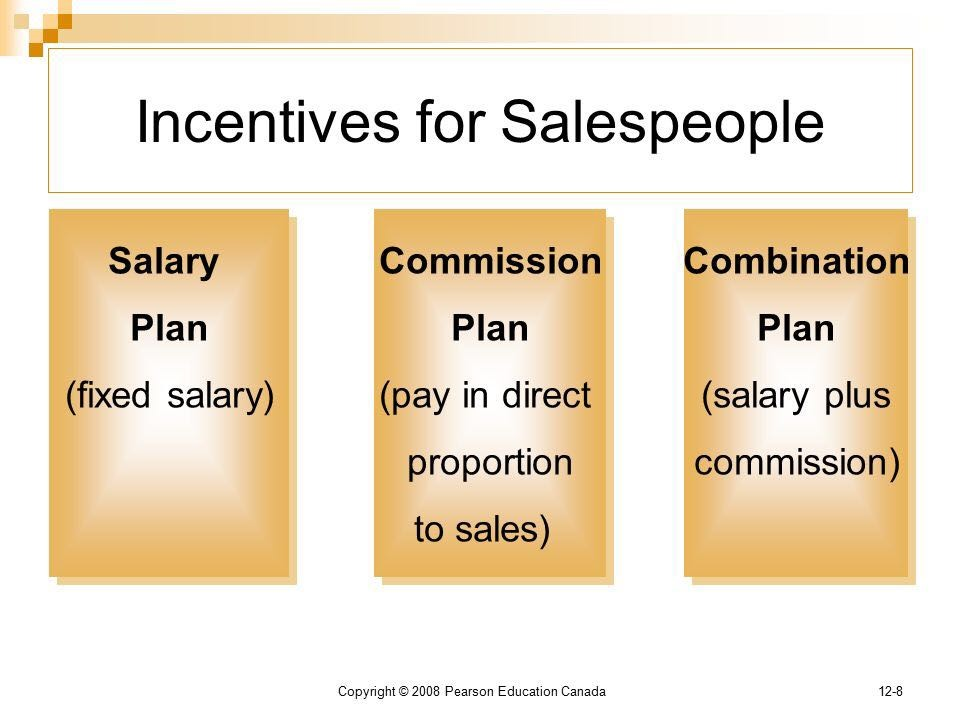

1. Straight Salary
   Straight salary sales compensation plans aren't very common, but they do have a place in some organizations. With this type of structure, you'd pay your salespeople a straight albeit competitive salary like all of your other employees, and nothing else. No bonuses, no commissions, and few, if any, sales incentives.
   This type of compensation plan is most often used when the industry you operate within prohibits direct sales, when salespeople work as part of small groups or teams and all contributions are equal, when your sales team is relatively small, or when your salespeople are expected to spend much of their time on other responsibilities other than selling.
   However, these plans don't tend to offer motivation to salespeople, as there are no incentives for them to work harder.
2. Salary plus Commission
   Salary plus commission sales compensation plans are possibly the most common plans used today. They're structured in a way that salespeople receive a lower base salary along with commission pay that makes up the majority of the total compensation.
   Organizations use salary plus commission sales compensation plans when there are opportunities to support all salespeople on this structure and when there are proper metrics in place for tracking sales to ensure that the splits are fair and accurate.
   This type of plan is often the better choice as opposed to straight salary because it offers motivation to increase productivity and to achieve goals. It also offers more stability. Salespeople will still get some types of pay even if they're in training, when sales are low during certain months, or if market conditions get volatile. However, it can be more complex to administer.
3. Commission Only
   Commission only sales compensation plans are exactly what they sound like you pay your sales people for the sales they bring in and nothing else. There is no guarantee of income.
   These types of plans are easier to administer than salary plus commission and provide better value for your money paid as they are based solely on sales achieved. They also tend to attract fewer candidates, but do attract the most top-performing and hardest working sales professionals who know they can make a good income because they know how to sell. On the other hand, though, they can create aggression within your sales team and low income security, which can lead to a high turnover rate, and sales rep burnout from stress.

   29.Chest X-Ray. 胸部 X 光

This is one picture that you probably you all know what it is when you see it. It's a familiar looking image. It's something that probably we all have some personal experience with, right?
This is a chest x-ray that would be taken in your doctor's office, for example, or a radiologist's office.
And it is a good example of Biomedical Engineering and that it takes a physical principle, that is how do x-rays interact with the tissues of your body, and it uses that physics, that physical principle to develop a picture of what's inside your body, so to look inside and see things that you couldn't see without this device. And you'll recognize some parts of the image, you can see the ribcage here, the bones you can see the heart is the large bright object down here.
If you, have good eyesight from the distance, you can see the vessels leading out of the heart and into the lungs, and the lungs are darker spaces within the ribcage.

30.Robots. 机器人

This lecture talks about the design of robots.

1. Why is it difficult to make a robot like a human being? Why cannot robots finish the work easily like human beings?
2. For some tasks, it is easy and simple for humans to complete, but it is very difficult to ask a robot to do what we want because humans can separate things by our senses, but robots cannot.
3. For example, considering the insights, it is hard for robots to recognize colours because they do not have sensory mechanisms.
4. Artificial intelligence scientists devised a sensor that is implanted to robots to enable them to recognize different colours.
5. The sensor has a camera on it to capture pixels, and then the sensor will transform/translate/transfere the pixels into an image, which is not as easy as expected. This process is very complex.
6. The translation of every pixel to accurate things could be difficult, especially colour differentiation which needs complicated sensory to fulfil. So the improvement of the sensor is necessary.
   In conclusion,
   there is no comparison between humans and robots.

   31.Wilson. 威尔逊

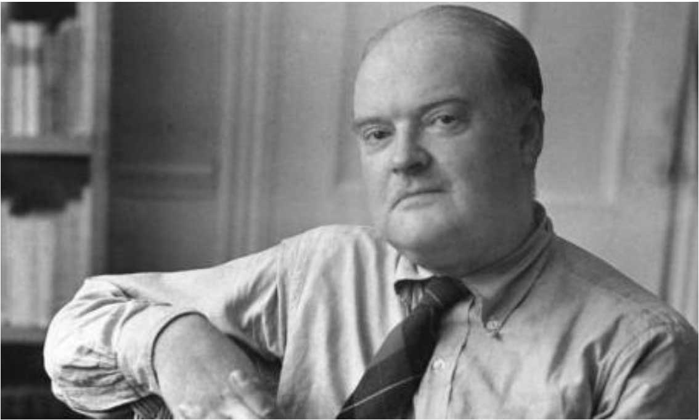

Wilson came from a different world. And he became the focal point of a board mainstream. American culture that thought that modern literature and wanted modern literature to be able to be read and appreciated by ordinary people. They were not modernists in an abstract sense. And certainly, some of them like TS Eliot and Faulkner were too difficult for some of their writings to be read by ordinary people. But this was a world before the division between the brows or between a lead or whatever had established itself as a part of our consciousness. Wilson was a major player in the successful effort of his generation to establish at the heart of American life and innovative literature that would equal the great cultures of Europe. And he knew that the great cultures of Europe were there. He was not a product of a narrow American Studies kind of training at all. He joined a high artistic standard with an openness to all experience and a belief that literature was as much of a part of life for everyone as conversation. He thought the Proust and Joyce and Yeats and Eliot could and should be read by ordinary Americans and helped that to happen. Wilson was a very various man. Over a period of almost 50 years, he was a dedicated, a literary journalist, and an investigative reporter, a brilliant memoirist, and dedicated journal keeper.

32.Teaching. 教学

All of my research and that I conducted was my 60 plus graduate students, was motivated by their need to learn, so that we can teach. Of course, in some inventions happened along the way but I've always considered the end the result. And I always consider that this invention to be byproduct, byproducts of the learning process. The end product for me was always better understanding or when one really succeeded in unifying theory that can help us in teaching the subject. I've also looked at teaching as a vehicle to try new ideas, of new ways to doing things on an intelligent group of learners. That is as the vehicle for the teaching-research results. And in my experience, this kind of teaching is the most stimulated and motivating to students. I am also uncovered many interesting research problems is the cause of teaching subject. It is this unity of research and teaching their close connection and the benefits gathered by exercising and the interplay that to be characterised the successful professor.

33.Happiness. 幸福

1. Happiness comes from frequency and quality of social relations, which are relations with friends, family and others.
2. There is evidence that when people feel more satisfied with their social relations, they feel happier.
3. In turn, when people feel happier, they will feel more satisfied with social relations.
4. So some people wonder if their social activities make them happy, or their happy personalities drive them to socialize more with friend and families.

   34.Psychologist. 心理学家

For better or worse, we live in a world profoundly affected by Sigmund Freud. If I had to ask you to name a famous psychologist, the answer of most of you would be Freud. He's the most famous psychologist ever and he's had a profound influence on the 20th and 21st century. Some biographical information: he was born in the 1850s. He spent most of his life in Vienna, Austria, but he died in London and he escaped to London soon after retreating there at the beginning of World War Two as the Nazis began to occupy where he lived. He's one of the most famous scholars ever but he's not known for any single discovery. Instead, he's known for the development of and encompassing theory of mind, one that he developed over the span of many decades.

35.A Ship. 船舶

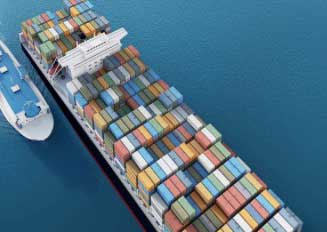

"Our civilization, which subsumes most of its predecessors, is a great ship steaming at speed into the future. It travels faster, further, and more laden than any before. We may not be able to foresee every reef and hazard, but by reading her compass bearing and headway, by understanding her design, her safety record, and the abilities of her crew, we can, I think, plot a wise course between the narrows and bergs looming ahead. And I believe we must do this without delay, because there are too many shipwrecks behind us. The vessel we are now aboard is not merely the biggest of all time; it is also the only one left. The future of everything we have accomplished since our intelligence evolved will depend on the wisdom of our actions over the next few years. Like all creatures, humans have made their way in the world so far by trial and error; unlike other creatures, we have a presence so colossal that error is a luxury we can no longer afford. The world has grown too small to forgive us any big mistakes."

36.Library. 图书馆

You'll see the service desk after entering the library and you can have these services at the service desk. There are computers on each floor. You can use computers to access the internet, check emails and library catalogues. Follow the orange signs to find printers. Follow the instructions to use the printers. Remember to bring student cards. You can charge the card to use printers.

37.Bees talks. 蜜蜂舞蹈交流

Video
Honey bees do a waggle dance to direct other bees to the sources of nectar. The dancing bees like this one can be halted by a headbutt from another bee. Now research has found that this headbutt is actually a warning signal. A feeding station was set up in the lab to mimic a source of nectar, then foraging bees were introduced to the dangers at the station, such as competition from rival colonies. When foragers returned to the hive they stopped bees dancing. Scientists think the behaviour warns dancers of a dangerous source of nectar.

38.Superhuman. 超人

Today we're going to recount heroic tales of superhuman feats of strength, when in the face of disaster, some people are said to have summoned up incredible physical power to lift a car off of an accident victim, move giant rocks, or like Big John of song, single-handedly hold up a collapsing beam to let the other miners escape. Are such stories true? There are many anecdotes supporting the idea, but we're going to take a fact-based look at whether or not it truly is possible for an adrenalin-charged person to temporarily gain massive strength. In proper terminology, such a temporary boost of physical power would be called hysterical strength. The majority of them are anecdotal, and interestingly not repeatable; in many cases, the person who summoned the superstrength later tried it again only to find that they couldn't do it. Basically, what we have is a respectably large body of anecdotal evidence that suggests that in times of crisis, danger, or fear, some people have the ability to temporarily exercise superhuman strength.

39.Clouds. 云

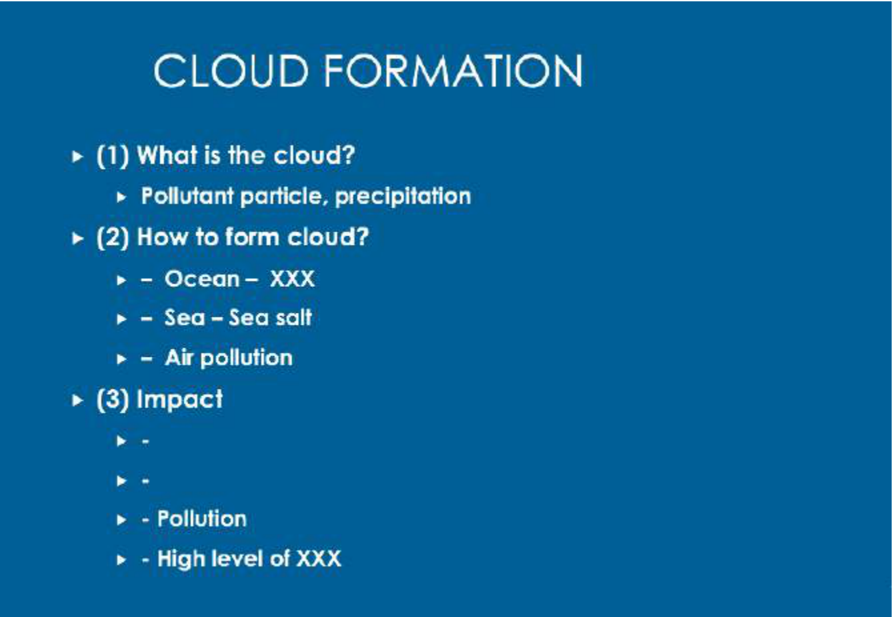

There is a lot of interesting. What forms these clouds, why are these clouds there, why do they sort of stick around? At the center, every cloud drop has a particle. You can't grow a cloud drop without having a particle there for the water to condense on. The key question that people not directly address until very recently is what actually forms these clouds. So for once you're looking out at over the ocean, turns out sea spray, sea salt is a very effective nucleus for forming clouds. So it's a really good chance that those are loaded with sea salt. But if you go inland, you start to have pollution come from all kinds of places, and so different sources form clouds more effectively than others, and we're trying to unravel which sources are actually contributing to the clouds. The clouds are incredibly important players in climate change, and that they reflective the white, they reflect the light back into space and so they're keeping things much, much cooler than they would be if they weren't there. They also play huge role in regional weather, so in actual we're starting to see shifts where having more pollution input into the clouds is affecting weather patterns, in particular, is actually reducing the precipitation so we're starting to see drought in areas with super high levels of air pollution.

40.Rice. 水稻/米饭

In 1943, what became known as the Green Revolution began when Mexico, unable to feed its growing population, shouted for help. Within a few years, the Ford and Rockefeller Foundations founded the International Rice Research Institute in Asia, and by 1962, a new strain of rice called IR8 was feeding people all over the world. IR8 was the first really big modified crop to make a real impact on world hunger. In 1962 the technology did not yet exist to directly manipulate the genes of plants, and so IR8 was created by carefully crossing existing varieties: selecting the best from each generation, further modifying them, and finally finding the best. Here is the power of modified crops: IR8, with no fertilizer, straight out of the box, produced five times the yield of traditional rice varieties. In optimal conditions with nitrogen, it produced ten times the yield of traditional varieties. By 1980, IR36 resisted pests and grew fast enough to allow two crops a year instead of just one, doubling the yield. And by 1990, using more advanced genetic manipulation techniques, IR72 was outperforming even IR36. The Green Revolution saw worldwide crop yields explode from 1960 through 2000.

41.Venus. 金星

There is a picture, sort of artist's impression, before the space age of what Venus might be like on its surface and so this was looking at the planet Venus, it was science fiction and science fact all the way up to 56 before the start of the space age but it wasn't completely disproved, this idea of a really sort of lush environment on Venus until 1967, which is when the first measurements in detail were done at Venus. So Mariner four and Mariner five confirmed the feeling from an earlier space mission that in fact the surface of Venus was not like this at all, but extremely hot and, and also that the clouds were made of sulfuric acid so there wasn't a nice water cycle like is going on in this picture and so, that it had to wait for these in situ measurements by space craft to actually do that and so Venus turned out not to be quite as Earth like as we thought and I'll sort of tell you about some of the latest results from Venus Express, which, which they actually there are some Earth like features, but to a large extent, it's not like the Earth. Okay, so a brief comparison between.

42.Practice. 实践

---

43.Linguists. 语言学家

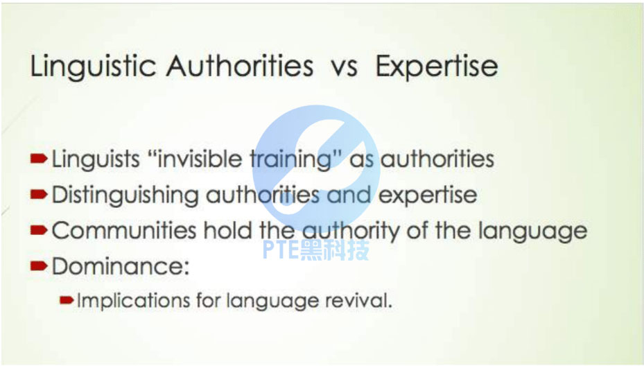

But when we move into working with communities, we have to recognize that the communities have to be the authority in their language. Actually a woman in the class I'm teaching at Sydney at the moment, a career woman, expressed this very nicely, although she was talking about something else, she was distinguishing expertise from authority. And certainly linguists because of our training we do have expertise in certain very narrow areas of language, but we don't have the authority over what to do with that knowledge or what to do with other knowledge that the community produces. I guess for me the bottom line is languages are lost because of the dominance of one people over another. That's not rocket science, it's not hard to work that out. But then what that means is if in working with language revival we continue to hold the authority, we actually haven't done anything towards undoing how languages are lost in the first place, so in a sense the languages are still lost if the authority is still lost.

44.Government Blogging. 政府博客

We normally see blogging as a two-way interaction, in which the blogger creates the content and the readers interact or challenge the author.
But the case will be much difficult when it comes to government, such as the White House.
Because people will become more coarse and rude online, especially in the comment area.
Hence the governor blog may go wild and chaotic.
So the government will have to administrate the comment.
Once the government starts administrating the comment, citizens may find the government manipulating what should be said and what should be shown, which contradicts the original intention.

45.A survey. 一项调查

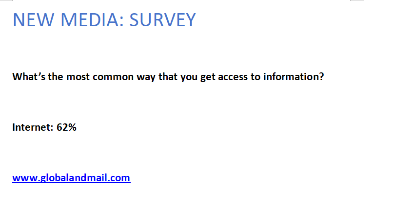

Let's say if I'm asking which source do you often use to get information. Newspaper? Radio? TV? And the survey shows 62 of the people chose Internet. You might be thinking I am going to say, how important the internet is, or how quickly it has changed the world for a few years. But what if I tell you this survey is conducted on the website global and mail. com? Our answer will be different. Because the people who did this survey on a website must be frequent users of Internet. This sample is a biased sample. So we have to pay attention to how a survey is conducted.

46.The politics of happiness. 幸福政治学

As Joanne pointed out, only one country, tiny little Bhutan, wedged between China and India, has adopted the Gross National Happiness as the central index of government policy, and actually has a good deal of success in education and in health and in economic growth and in environmental preservation. They have a rather sophisticated way of measuring the effects of different policies on people's happiness. They are the only country to go that far.
But you are now beginning to get other countries interested enough to do kind of white paper policy analyses of happiness research what effects would it have if we used it more for public policy? You are beginning to get countries like Australia, France, Great Britain, that are considering publishing regular statistics on happiness. So it is beginning to become a subject of greater interest for policymakers and legislators in different advanced countries.

47.Melatonin. 褪黑激素

Video
I'm just going to take on the stuff where left off. The hormone I want to now talk about it's called melatonin. The synthesis is in the Pineal Gland, which is very small. It is the size of a pea in your brain. The corpus is the site of the soul, and it is where melatonin is made. And it has a rhythm as well. And in this sense, it is the opposite of the cortisol. It peaks at night. We call it the darkness hormone. In every species that we studied, melatonin occurs at night. And it's a hormone that prepares you for the things, that your species, does at night. So, of course, in humans we sleep, but animals, like rodents, they are awake. It's a hormone that is related to darkness behavior.

48.Early spring. 早春

The Earth's temperature is rising. And as it does, springtime phenomena like the first bloom of flowers are getting earlier and earlier. But rising temperatures aren't the only factor. Urban light pollution is also quickening the coming of spring."So temperature and light are really contributing to a double whammy of making everything earlier." Richard ffrench-Constant, an entomologist at the University of Exeter. He and his colleagues compiled 13 years of data from citizen scientists in the U. K., who tracked the first bud burst of four common trees. Turns out, light pollution from streetlights in cities, and along roads pushed bud burst a full week earlier. Way beyond what rising temperatures could achieve. This disruptive timing can ripple through the ecosystem."The caterpillars that feed on trees are trying to match the hatching of their eggs to the timing of bud burst. Because the caterpillars want to feed on the juiciest and least chemically protected leaves. And it's not just the caterpillars, of course, that are important. But the knock-on effect is on nesting birds, which are also trying to hatch their chicks at the same time that there's the maximum number of caterpillars." So earlier buds could ultimately affect the survival of birds, and beyond. The findings are in the Proceedings of the Royal Society B. The world's becoming increasingly urbanized, and light pollution is growing which ffrench-Constant says could trick trees into budding earlier and earlier. But smarter lighting like LEDs that dial down certain wavelengths could help."Perhaps the exciting thing is, if we understand more about how light affects this bud burst, we might be able to devise smarter sort of street lighting that has less red components, and therefore less early bud burst." Thus keeping springtime an actual springtime phenomenon.

49.Bird migration. 鸟类迁徙

---

50.Hazardous chemical product. 危险化学品

配图是一个杀虫剂的罐子，正面是草地，反面是警示信息
1、When you look at the label on a hazard chemical product, the lovely picture looks nice and won’t make people think of dangerous meanings. The warning information is only displayed at the back.
2、This design is very concerning. The warning font is small, which makes it even more difficult to read.
3、60% of Americans cannot recognize fonts smaller than size 10, and 40% of Americans are illiterate.
4、While people cannot recognize easily or cannot read, they won’t be aware of the hazardness of these chemical products.

51.Animal behavior. 动物行为

Video
We can ask two fundamental questions about animal behavior, they referred to as proximate and ultimate. Proximate questions are those concerned with the mechanisms that bring about behavior, ultimate questions are those concerned with the evolution of behavior. We can divide the proximate and ultimate questions into two sub-questions. For proximate, how does the behavior develop, and secondly what causes the behavior. For ultimate, you can ask how did the behavior evolve, and secondly what is the adaptive significance of the behavior, what's the purpose. Together these comprise what are called Tinbergen's four questions about animal behavior. Niko Tinbergen was one of the founding fathers of the study of animal behavior. These questions represent the different ways of studying animal behavior and understanding the difference between those four questions are fundamental to understanding behavior and indeed the whole of biology. How do we study animal behavior well that depends on the type of question we're hoping to answer.

52.Smell of books. 书籍气味

Indeed, the library. We've all been to a historic library. We've all enjoyed the smell of a historic library. But what is it? And what does it mean? When we've recently, when at UCL Center for Sustainable Heritage, we've recently been asked to access the environment at another historical library at Saint Paul's Cathedral, the Wren library, an incredible place. And it has a such an intensive smell of old books, and we were also asked for the first time really I was actually taken aback by the brief, we were asked what you do please preserve the smell. It is so important to our audience. It is so important how people perceive the library. So, that is, that was quite an important message in our research. And indeed the smell is an important way of how we communicate with the environment. This piece of research was done by an advertising company because advertisers are so interested in how we, how we interact with each other and the environment. And we see that the majority of people use sight obviously to interact with the environment, but on the second place, we see the smell is also very, very important.

53.Shy fish. 害羞的鱼

When you think of a leader, you may think of an individual who is above all bold. But a new study of fish called sticklebacks shows that shy individuals actually prefer to follow fish that are similarly timid. Researchers had trios of sticklebacks with known personalities play follow the leader. The fish were placed in a tank that had some plastic plants at one end and some food hidden at the other. In some of the groups, a bold fish and a shy fish acted as leaders, while another shy fish followed. And in other groups, it was a bold fish that did the following. The researchers recorded whether the follower sallied forth more frequently with the fish that was behaviorally similar or the one that was different. What they found is that shy fish were more likely to emerge from undercover when an equally wary fellow was already out there. Bold follower fish did not seem to care which leader they followed. Of course, no matter which fish a stickleback chose to stick with, the bold fish did lead more expeditions over the course of the experiment than their more retiring friends. That's because the bold fish initiated more trips, regardless of who might be tailing them. The findings are in the journal Biology Letters. The researchers write that when offered a choice of leaders, sticklebacks prefer to follow individuals whose personality matches their own, but bolder individuals may, nevertheless, be able to impose their leadership, even among shy followers, simply through greater effort. We may soon see if such tendencies also hold true in humans, when Americans decide who they'll follow in November. Unless, of course, something fishy happens.

54.Knee. 膝盖

The sound of a cracking knee isn't particularly pleasant. But it gets worse when you listen up close."It does for most people. But for me, it actually just makes me excited." Omer Inan, an electrical engineer at Georgia Tech."I actually feel like there's some real information in them that can be exploited for the purposes of helping people with rehab." Inan's experience with cracking knees goes back to his days as an undergrad at Stanford, where he threw discus."If I had a really hard workout, then the next day, of course, I'd be sore, but I'd also sometimes feel that I would feel this basically catching or popping or creaking every now and then in my knee." A few years later, he found himself building tiny microphones at a high-end audio company. So when he got to Georgia Tech and heard the Defense Advanced Research Projects Agency, DARPA, wanted better tech for knee injuries, he thought: Why not strap tiny microphones to people's knees, to eavesdrop as their legs bend?"What we think it is, is the cartilage and bone rubbing against each other, the surfaces inside the knee rubbing against each other, during those movements." He and a team of physiologists and engineers built a prototype with stretchy athletic tape and a few tiny mics and skin sensors. And preliminary tests on athletes suggest the squishy sounds the device picks up are more erratic, and more irregular, in an injured knee than in a healthy one. Which Inan says might allow patients and doctors to track healing after surgery. Details appear in the IEEE Transactions on Biomedical Engineering."The primary application we're targeting at first is to give people a decision aid during rehabilitation, following an acute knee injury, to help them understand when they can perform particular activities, and when they can move to different intensities of particular activities." A useful thing to take a crack at.

55.Sugar. 糖

Video
There's sugar in a lot of foods where you don't expect it. Of course there's lots of sugar in donuts of ice cream, or pastries, or other things that are sweet; candy of course, but there are other places where you see it and you don't necessarily expect it. So as an example: peanut butter. Here's a list of ingredients from Skippy Peanut Butter and you see that sugar is the second most common ingredient. So that you may know from the reading food labels that these ingredients in any food labels that are listed in order of how much there is in the food itself, so sugar comes right after peanuts. Here's another example, Beef stew, you wouldn't necessarily expected to find sugar in beef stew but it's there. Now it's down the list of ingredients, it's actually toward the end, but if you look at the marketing of this and food at the can, it says, there's fresh potatoes and carrots, but actually there's more sugar in this than there is carrots. And so you wouldn't eat something like beef stew and expect to find this to be the case.

56.Music and well-being. 音乐与幸福感

Video
So what do we mean by well-being? Health, happiness, a sense of achievement and contentment, a state of mind and body where people can thrive. Well-being is not something that is purely limited to people who are facing extraordinary challenges in their lifestyle, health or personal circumstances, everybody here has a level of well-being. Music so often forms an intuitive part of our well-being management, music to pick us up, music to calm us down, music to heal our sorrows. Our aim through research is to move from this level of intuitive application of music through to informed use in our communities to take the next step in the understanding of the power of music in human life. Music already works for us on so many levels whether it's soothing and teaching our infants bringing people and communities together adding spirit to our work and personal endeavours, but there is no reason to stop here.

57.Early Robot. 早期机器人

Video
This is a kind of object that you're probably all familiar with when you had the term robot, but I'm gonna show you the very, very first robots. These were the very first robots. They were characters in a play in the 1920s called Rossum's Universal Robots and they, the play was written by Czech writer called Karel Capek. And basically, these robots, you know, people tend to think of robots as kind of cute cuddly toys or, you know, Hollywood depictions kind of devoid of politics. But the first robots were actually created and imagined in a time of absolute political turmoil. You just had the First World War, you know, it finished had a devastating impact across Europe and so people will kind and people are kind of reflecting on what does it mean to be human, what makes us human, those kinds of question. And this kind of context is what inspired Capek to kind of write this play. And interestingly, these robots being human, they are actually in the play assembled on a production line, a bit like the Ford manufacturing production line. So even though they are human, they are assembled and these robots are designed to labor, and that is their primary purpose in society.

58.London fog. 伦敦雾

Video
Turner, not surprisingly, painted one of the earliest pictures of London's fog, in the 1835 painting the Thames above Waterloo Bridge. Turner is a trueborn Londoner, is advertising his familiarity with London's air problem by putting smoke, an atmospheric pollution at its center. And as you can see, in here, the bridge is the central elements, which is a theme that's later taken up by Monet. And it's partly obscured by the steam and smoke which rises from both sides of the river. Here, we see a shot-tower. I think you can just about to see, which was constructed in 1826. Do you know what shot-towers are? They produce shot for guns, ammunition. And they were very smoky, one of the most smoking industries. But it's barely visible, as you can see, as are the various industries on the Lambuth side of the river. There's, on this side, there's a steamship about to dock or preparing to leave. It's black smoke thrusting up to join the kind of swirling arc of smoke there. William Rodner sees this painting as a potent essay on the energy and complexity of modern polluted urbanism. Smoke, I think, here represents for a flourishing economy, which brings employment and food on tables but also the dirt and pollution associated with the fumes all seems to be tainted by sulfurous yellow.

59.Biology. 生物学

Welcome to your very first tutorial in biology. Now, in this video series what I want to do is I want to talk to you guys about many different topics concerning biology. For example, I want to talk to you guys about DNA and genetics in cells, in bacteria, in life and a whole bunch of interesting stuff. But since this is the very first video, I think what we should do in this video is just stick with the very basics. And the first thing I want to do is talk to you guys about what is biology. So, let's go ahead and answer that question. And the definition of biology is this: the study of life in living organisms. All right, that makes sense up to a certain point up until organisms because you may have heard of organisms before. And you may have your own definition but the scientific definition of an organism is a living thing. Well, that's easy. We know what living things are. I'm a living thing, plants, grass is a living thing. My puppy named old Dan, cutest puppy ever, by the way, is a living thing but whenever we talk about living things. Believe it or not, things get rid of complicated because then you have to ask yourself what is life. Well, of course, if you ask your grandma or your best friend or even if you ask a philosopher what is life, everyone is going to give you kind of a different definition of their outlook on life. However, whenever scientist and biologists were first deciding, you know what, what is life? That's the problem that they had everyone had their own separate definition of life itself. So, what they need to do before biology was even invented, which is, of course, the study of life is scientists needed to agree on the definition of life.

60.Pavlov Experiment V2. 巴甫洛夫实验 第二版

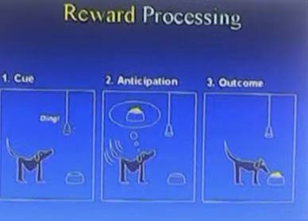

During this time my goals are going to be to talk about the phenomenon that we may share impart with other animals, and our language and that is emotion. And also talk about some new technology, brain imagining, functional magnetic imagining. And we try to answer some very old questions about how does motivation and emotion work. I'm going to put you with the scenario first and some of you may be familiar with. This was developed by Pavlov over a century years ago. And in this scenario the dog presented with the sound, the dog waits, and then feeds food powder and this happened repeatedly, things starts to happen in the middle of the experiment there. Interesting things start to happen here. Pavlov's study was salivation the dog, the salivation increases more time to paralyzes. But other things happened here, too. You have a dog move around here more, all kinds of things are going on here. What we trying to capture was the experiment I'm going on to describe today is what is going on in the brain to generate that state which we called it competitive state. But you can also think about state in terms of how the dogs feeling layer, how you feeling about eating lunch today.

61.Cars in Washington. 华盛顿汽车

---

62.King. 国王

Video
At the top, you would have a king. Now the king would rule over a kingdom. Now, this is not so easy to govern especially during the Middle Ages. And the king might owe many people, things especially people who help the king come to power, helped him dispose the previous king or to conquer this land. And so in exchange for that and to help govern, he might grant land or feasts to other people. And the key currency in the Middle Ages under the feudal system island. And land in exchange for loyalty and service. So this whole thing is a kingdom. Now right over here, this is a duchy. And a duchy will be controlled by a duke. I guess I didn't call it duckie because that just doesn't sound as serious. So the king might grant a duchy, a duchy to a duke and in exchange, the duke would provide loyalty pledged their fealty. If the kingdom is threatened, the duke will fight alongside. The king would provide their own troops if the king wants to go conquer other territories, same thing, and also provide the king with taxes which might be in the form of coinage depending on what time and region we are in the Middle Ages or it might be in the form of a percentage of the agricultural production from this duchy.

63.Telescope. 望远镜

---

64.A successful entrepreneur. 成功企业家

To be a successful entrepreneur, you should have good ideas, but the definition of a good idea varies depending on whom you ask. A great idea should have several features. Firstly, the great idea should be various and novel. Secondly, the great idea should be unique, which means no one has thought about it. Thirdly, it is essential for great ideas to be transformative and productive. All ideas are essentially a combination of other smaller ideas, but this doesn't mean they can't be unique. Merely copying doesn't make anything idiosyncratic, it's the individuality that one puts in which makes a concept stand out. Constant innovation leaves no room for stagnation and thus, adds on to the basic idea, effectively making it unique. Unique ideas are inspired by basic things, they are simply extensions of pre-existing notions. And, an idea or a concept is unique only when it transcends its predecessor and serves its purpose in a better and more precise way.

65.Four fundamental forces. 四种基本力

There are four fundamental forces at work in the universe. Some of them are very familiar from everyday life. Some of them are not. So we all know about gravity. That's one of the four forces. It's what keeps our ankles to the surface of the earth, and keeps the Earth in orbit around the Sun. There is another force that we're very familiar with, which is the electromagnetic force. That is the force that is responsible for the electricity, electric currents for light, for the sun's light, that's electromagnetic radiation coming from the Sun to the Earth.
There are two other forces though that are somewhat less familiar. They are the nuclear forces. They are forces that are at work within the nuclear atoms. One of those forces is called the strong nuclear force. That really is the force that bides protons to protons, bides the corks inside of the protons and neutrons keeping them from flying out. The other nuclear force is called the weak nuclear force. And that's a force that predominantly we know of because it's responsible for radioactivity, radioactive decay.
So those four forces, strong nuclear force, weak nuclear force, electromagnetic force and gravitational force, those are the forces that work in the universe.

66.Universal philosophy. 普世哲学

Okay. So this is the this is the big benefit of a universal philosophy. It says it applies to everybody. Well, looks that doesn't, you know, 205 or 206 countries in the world. And you've got something that applies to everybody. That's a bit strange, isn't it? No, says liberal theory. There are some value structures that apply to all of us. You couldn't have the United Nations without it. It couldn't tell you that the Universal Declaration of Human Rights without this idea of values that apply to all of us just because we are humans. Now, the idea is to test that as well. Why is sport universal? Why does everybody play football? It's because the values are specified at a very thin level at the top. There are these rules and we all have to abide by just these rules. But there are lots of things about football that aren't rules specified. So Brazilian football is different from Italian football, from British football, from German football, from Spanish football. It's culturally specific, but acknowledges that there are these universal general rules to apply to everybody.

67.Licking and grooming. 舔舐与梳理

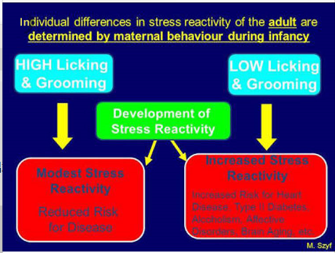

The study explores the impact of maternal licking and grooming( LG) on the stress reactivity of adult rats. LG refers to the level of attention and care provided by mother rats to their offspring through licking and grooming behaviors. The experiment examined the effects of high and low levels of LG on the stress reactivity of the rats as they grow into adulthood. The findings reveal that high LG leads to a more moderate stress reactivity in the rats. This has significant implications as it suggests that a nurturing and attentive environment during infancy can potentially reduce the risk of poor development and diseases later in life. On the other hand, low LG results in an increased stress reactivity in the rats. This, in turn, elevates the risk for various health conditions such as heart disease, type II diabetes, alcoholism, affective disorders, and brain aging. These findings highlight the crucial role of maternal care and attention in shaping the stress response system in offspring. It demonstrates that early experiences and maternal care can have long-lasting effects on an individual's stress reactivity and overall health. This study underscores the importance of providing nurturing and supportive environments for infants to promote optimal development and reduce the risk of various health issues in adulthood.
